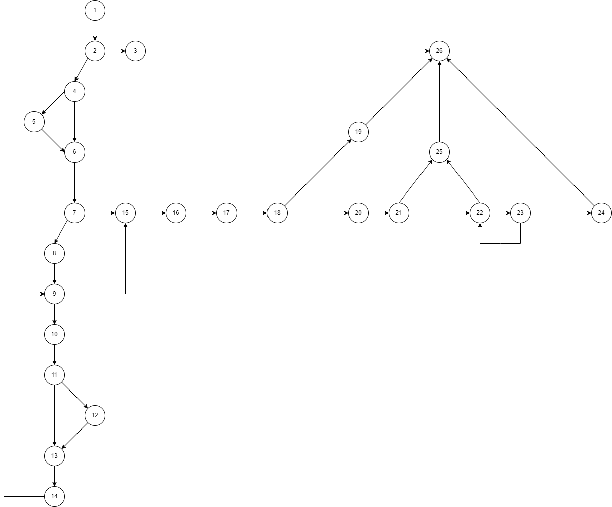

# SI_2023_lab2_213142

Ognen Romevski 213142

# Control Flow Diagram

# Цикломатска комплексност

Кодот има цикломатска комплексност од 11, кој се добива преку броење на регионите.

# Every branch

# Multiple conditions

# Unit tests